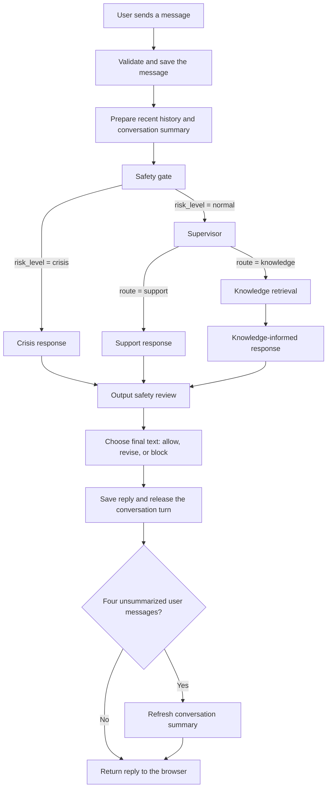

# How a message moves through Seher

Seher uses a language model for several distinct jobs: assessing a message, choosing how
to respond, writing a response, reviewing it, and occasionally summarizing the conversation.
LangGraph connects these jobs into a defined workflow. A user sees one reply, but several
steps take place before that reply reaches the screen.

This document describes the current implementation. It is self-contained: no knowledge
of the source code is needed.

## The complete journey

The graph has seven nodes: **safety gate, supervisor, support response, knowledge
retrieval, knowledge-informed response, crisis response, and output safety review**.
Saving messages, preparing memory, refreshing the summary, and updating the browser are
application steps surrounding the graph, rather than graph nodes.

## 1. Before the graph: accept the message and prepare context

When the user sends a message, the browser shows it immediately and disables the send controls while waiting. The server checks that the user is signed in, owns the conversation, has supplied nonempty text, and is sending to an active conversation that is not already waiting for a response.

If these checks pass, Seher saves the user message with its position in the conversation and marks the conversation as waiting for the assistant. It then creates an execution record for this response so the processing steps can be inspected later.

Seher builds conversation context from two sources:

- **Recent history:** the latest eight saved messages, in chronological order, with their user or assistant roles. This includes the message just submitted.
- **Longer-term context within this conversation:** the existing rolling summary, if one has been generated.

The latest message is also supplied separately as the current input. Not every agent receives the prepared history: the safety gate and output reviewer currently use narrower inputs, as described below.

## 2. What LangGraph does

LangGraph is the workflow coordinator. It does not itself understand feelings, determine risk, or write the answer. It runs the configured nodes and follows the connections between them.

A **node** is one processing step. A node can call a language model, retrieve documents, or perform other application work. An **edge** says which step can run next. Some edges are fixed; others depend on a structured decision produced by a node.

The nodes share a working record called **state**. It carries the current message, conversation context, record IDs, safety assessment, chosen routes, retrieved reference text, and response text. Each node returns updates to that record for subsequent nodes to use.

For example, the safety gate writes `safety_route = crisis`. LangGraph reads that value and selects the crisis node. The language model does not independently call whichever agent it wants: it produces a permitted decision, and the application follows the corresponding edge.

In this version, nodes execute sequentially. There are no parallel response agents, agent debates, or repeated review loops. The application database stores the durable messages and execution records; this flow does not use a LangGraph checkpointer to resume a failed run from its last completed node.

## 3. Safety gate: which broad path should this message take?

**Receives:** the current user message and the safety agent's configured instructions.
It does **not** receive the conversation history or rolling summary.

**Does:** asks the safety model to assess the message. The response must have a defined structure containing a risk level, relevant risk categories, a recommended action, and a crisis-resolution value. The application validates that structure before using it.

**Produces:** a saved safety assessment and one of two routes:

| Risk level returned | Next node | Meaning for the workflow |
| --- | --- | --- |
| `normal` | Supervisor | Choose between ordinary support and knowledge-assisted support. |
| `crisis` | Crisis response | Bypass ordinary routing and generate a crisis-focused response. |

The current routing decision uses **risk level only**. Although the model also returns recommended action and crisis resolution, those fields do not independently choose the next node. The stored conversation mode is updated to match this turn's risk level.
A previous crisis classification does not permanently keep later messages on that path.

This is an **input guardrail**: an assessment that changes how the message is handled.
It is a model judgment, not a diagnosis or a guarantee that every risky message is detected.

## 4. Supervisor: does ordinary support need reference material?

This node runs only when the safety gate chooses `normal`.

**Receives:** the current message, recent conversation history, rolling summary, and supervisor instructions.

**Does:** asks the model to choose a workflow. It does not write the final answer.
The validated decision must be one of two values:

| Decision | Next node | Intended use |
| --- | --- | --- |
| `support` | Support response | Respond using the conversation context and support instructions. |
| `knowledge` | Knowledge retrieval | Look up reference material before drafting a response. |

For example, “I just want someone to listen” is a plausible support request, while “Why do people replay conversations after a breakup?” may benefit from reference material.
These are illustrations, not hard-coded rules: the actual choice comes from the model using the configured supervisor prompt.

## 5A. Support response: write a draft directly

**Receives:** the current message, conversation history and summary, and the support agent's instructions.

**Does:** generates a supportive response. Its tone, length, and conversational behavior are influenced by those instructions and the underlying model. It does not retrieve knowledge documents on this path.

**Produces:** a draft response in the shared state.

**Next node:** always output safety review. The draft is not yet shown to the user.

## 5B. Knowledge retrieval: find useful reference text with RAG

This node runs when the supervisor selects `knowledge`.

**Receives:** the current user message as the search query. The full conversation history
is not included in that query.

**Does:** performs the retrieval part of **retrieval-augmented generation (RAG)**:

1. Send the query to an embedding model. It converts the text into a numerical vector representing aspects of its meaning.
2. Search Chroma, the local vector database, for document chunks with similar vectors.
3. Request five matching chunks and collect their text, metadata, and distance values.
4. Record the retrieval and links to available document-chunk records for later inspection.

This searches material that has already been indexed. It does not browse the internet when the user sends a message. During deployment population, document text is divided into chunks, embedded, and stored in Chroma so these searches are possible.

**Produces:** reference passages for the next node. This node does not write a reply.

**Next node:** always knowledge-informed response.

RAG supplies information that the response model can consult; it does not guarantee that the information is relevant or that the answer uses it correctly. The current search has no explicit relevance cutoff or document-status/public-visibility filter. Its returned distance is a search measure, not a confidence percentage.

## 6. Knowledge-informed response: turn references into a draft

**Receives:** the current message, retrieved passages, conversation context, and support instructions.

**Does:** asks the **same support agent used on the direct support path** to answer with reference text available. Instructions tell it to use relevant material, avoid forcing unrelated passages into the response, and respond naturally without explaining the retrieval machinery.

This is the generation part of RAG: retrieved text augments the model's input before it writes the answer. There is no separate factual-verification pass on this live path, and source citations are not automatically attached to the user-facing response.

**Produces:** a knowledge-informed draft response.

**Next node:** always output safety review.

## 7. Crisis response: use the assessment and configured resources

This node runs directly after a `crisis` result from the safety gate. It bypasses the supervisor, direct support node, and knowledge-retrieval path.

**Receives:** the current message, conversation history and summary, safety assessment, crisis-agent instructions, and resources supplied by an enabled crisis-resource policy.

**Does:** generates a crisis-focused draft. The application instructs the model to use only the supplied contact resources and not invent or change numbers, websites, or other resource details. If the required resource policy is missing or empty, the step fails rather than proceeding without that configuration.

Seher also records a **handoff** from the safety agent to the crisis agent. Here, handoff means a change between internal software roles. It does not contact a person, notify a family member, call a hotline, or dispatch emergency help.

**Produces:** a crisis-response draft.

**Next node:** always output safety review.

The resource restriction is a prompt-level guardrail. It reduces reliance on the model recalling contact details, but is not a deterministic check that the generated details exactly match the policy.

## 8. Output safety review: decide what can be returned

Every successful drafting path reaches this node.

**Receives:** the draft and output-review instructions. It currently does **not** separately receive the original user message, conversation history, or crisis-resource policy.

**Does:** asks a review model for a structured decision: allow, revise, or block.

| Decision | What the user receives |
| --- | --- |
| `allow` | The original draft. |
| `revise` | The reviewer's replacement response, with surrounding whitespace removed. |
| `block` | “I'm sorry, I can't provide that response safely.” |
| `revise` with an empty replacement | The same fixed refusal. |

**Next step:** the graph ends in all four cases. These decisions choose the final text; they do not route to different agents. A revision is not reviewed a second time.

This is the **output guardrail**. It can intercept a draft before delivery, but it is still a fallible model assessment. It does not establish that every permitted answer is factually correct, appropriate, or clinically safe.

## 9. After the graph: save the reply and refresh memory

Once the graph finishes, Seher marks its execution record completed and stores the final output. It then saves an assistant message, updates the conversation's last-message time, and changes the turn state back to idle.

Next, Seher checks whether at least four user messages remain unsummarized. If so, the memory-summary agent receives the existing summary plus the next four user messages and updates the summary for future turns. Assistant messages are not part of that summary batch. At most one batch is processed on each invocation.

If fewer than four user messages are pending, no summary call is made. If the summary call fails, the error is logged but the already-saved assistant reply is retained and returned. A successful call advances the summary marker; only nonempty summary text replaces the previous summary.

This provides **conversation-level memory**. It is not a separate permanent profile or cross-conversation memory system. Summaries can omit or distort details, so retaining a fact in memory does not guarantee that the model will apply it correctly.

## 10. Deliver the reply

The server returns the assistant's saved text and timestamp to the browser. The browser adds the reply to the conversation, displays its time in IST, and restores the input controls. A successful non-AJAX form submission instead redirects to the conversation page.

The whole response is delivered at once. Summary generation, when needed, happens before the HTTP response returns and therefore adds to the user's wait. Application logs and displayed times use IST; stored database timestamps remain timezone-aware UTC.

## What “agents” and structured outputs mean here

An agent is a configured role with instructions, a model selection, and generation settings. Multiple roles can use the same underlying model. Their different prompts and inputs define their jobs; they are not necessarily separate models or independently trained specialists.

The safety gate, supervisor, and output reviewer return structured JSON validated with Pydantic. This prevents an unexpected route such as `maybe_support` from silently becoming a valid graph decision. It checks the output's format and permitted values, not the truth or quality of the assessment.

Other agents return text. The application rejects empty generation responses. Model configuration and credentials come from the database, while deployment population can fill the API-key field from the environment.

## How many model requests does one message require?

| Path | Generation requests | Additional requests |
| --- | --- | --- |
| Direct support | 4: safety, supervisor, support, output review | None unless memory needs refreshing. |
| Knowledge-assisted support | 4: safety, supervisor, support, output review | 1 query-embedding request; optionally a memory refresh. |
| Crisis | 3: safety, crisis, output review | Optionally a memory refresh. |

A memory refresh adds one generation request. Retries can increase these counts.
Knowledge retrieval is a graph node but not a text-generation request.

## Guardrails at a glance

| Layer | What it controls | What it does not establish |
| --- | --- | --- |
| Login, ownership, and input checks | Who can submit to a conversation and whether the turn can start | The meaning or safety of the message |
| Input safety gate | Normal versus crisis routing | Guaranteed risk detection or a clinical diagnosis |
| Structured output validation | Permitted decision values and response structure | Correct reasoning |
| Supplied crisis resources | Which resource information the crisis prompt authorizes | Exact compliance in the generated text |
| Output safety review | Whether to allow, replace, or refuse a draft | Guaranteed safety or factual accuracy |

## What happens when something fails?

Generation requests allow up to three total attempts for selected transient API errors, including rate limits and server timeouts, with backoff between attempts. The SDK also retries supported transient transport failures. Invalid structured output is rejected after generation; it is not automatically repaired in another model call. Embeddings use a separate client configuration.

These retries happen inside an individual model request. They do not resend the user's message or rerun the whole graph. The configured timeout applies to each request rather than to the entire message journey, so retries may noticeably increase waiting time.

If graph processing still fails, Seher records the failure and resets the waiting state for caught generation errors. The user message stays in the database, but no assistant message is created. The AJAX endpoint reports model-generation failures as HTTP 503 with a service-unavailable message. Validation failures return 400; some other internal errors currently also use the generic form-error path.

The browser displays the error and re-enables its controls. Automatic resending and request deduplication are not implemented. A lost browser connection does not prove that the server failed to save a reply, and a process crash can leave a conversation waiting. Those recovery features remain future work.

## How the team can inspect and improve the flow

Seher records the chosen route, execution status, final response, step timings, selected step inputs and outputs, input assessments, retrieval results, and internal handoffs. These records help identify which step failed or produced an unsuitable result. They are not complete copies of every assembled model prompt. The recorded graph latency also excludes later message persistence, summary refresh, and browser delivery.

Separate evaluation tools test behaviors such as routing, grounding, memory use, and crisis-resource responses. They are not additional judges running on every live chat message. Their purpose is to provide evidence for changes to prompts, models, retrieval, and routing—not to make the workflow more reliable merely by existing.
